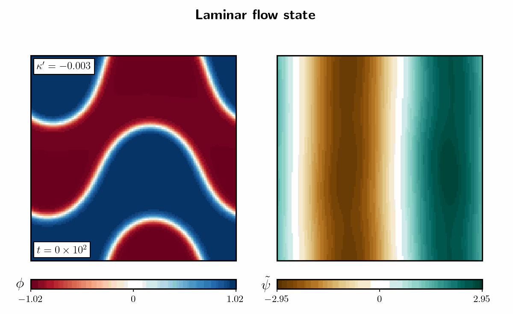
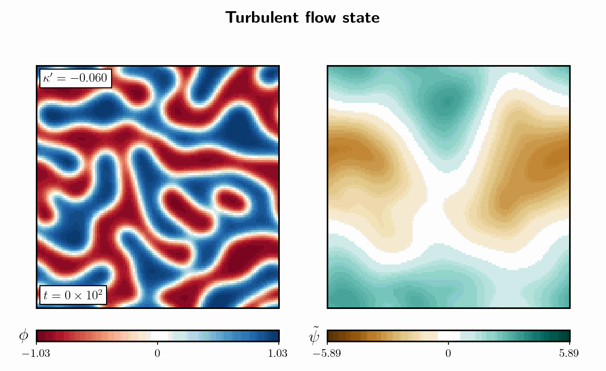
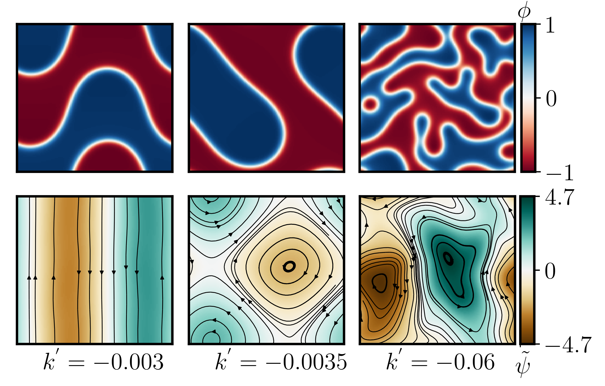

# ActiveModelH: 2D Pseudo-Spectral Solver

$\color{red}{\large \text{Active Model H: scalar field theory for dense active suspensions. In the contractile limit, model exhibit rich}}$ $\color{red}{\large \text{phase behaviour from laminar to turbulent flow.  }}$

<p align="center">
    <br>
  <em></em>
</p>

<p align="center">
  <br>
  <em> Phase diagram of the active model H: density field (φ) and stream function (ψ) along with velocity field lines (black arrow lines). (Left) Laminar flow state, (Middle) Vortex flow state, and (Right) Turbulent flow state.</em>
</p>

A C++ solver for a two-dimensional **Active Model H**: a conserved scalar order parameter $\psi$ (e.g. a density or composition field) coupled to an incompressible Stokes flow that is driven by an active stress. The equations are integrated with a pseudo-spectral method on a periodic grid, using **Intel MKL** for FFTs and **Armadillo** for array algebra. 

---

The repository also includes a Python script, `txt_to_matrix_extraction.py`. It collects the snapshot files into matrix format `.mat` file for analysis. 

movies/turb.gif
---

## Contents


<div align="center"> 
  
|1. [Building and running the code](#1-building-and-running-the-code)| 2. [Model](#2-model)| 3. [Input and output files](#3-input-and-output-file)|4. [reference](#4-reference)|
|----|----|----|----|

</div>

---

## 1. Building and running the code

To compile the code, it requires  `C++11 (or later) compiler`, `Cmake`, `Armadillo` linear algebra libraries and `Intel oneMKL` libraries. After downloading both the libraries, the code can be compiled
as the following.

### Set up the MKL environment (path depends on your install)
The exact MKL link line depends on your compiler, platform and threading choice. Intel's [oneMKL Link Line Advisor](https://www.intel.com/content/www/us/en/developer/tools/oneapi/onemkl-link-line-advisor.html) will generate the correct flags for you.


```bash
> source /opt/intel/oneapi/setvars.sh        # or: source /opt/intel/mkl/bin/mklvars.sh intel64

```

### Configure and build

```bash
> mkdir -p build
> cd build

> cmake -S ../ -B .

```

 ### Run

To make the executable file (in the same terminal)

```bash
> make
```

Now the executable file **activeH_heun.exe** will be created. To run the program

```bash
> ./activeH_heun <in/out dir>/ [options]
```

The first argument is the simulation directory. It must contain an `in_data` parameter file, and all output is written there. **Include the trailing slash**, since file names are built by simple string concatenation (`dir + "phi.txt"`).

Running without arguments prints the help message.

### Options

| Flag | Description |
|------|-------------|
| `-C <steps>` | Continue from `phi.txt`, `psi.txt` in the simulation directory. `<steps>` is the number of steps used in the previous average. |
| `-v` | Verbose: write the full state  at every print interval |
| `-n` | Disable noise in the $\phi$ equation |
| `-N` | Disable noise in the $\psi$ equation |

### Examples

```bash
# Fresh run with snapshots
> ./activeH_heun runs/test/ -v

# Continue a run (previous run had 1,000,000 steps)
> ./activeH_heun runs/test/ -C 1000000
```

### Stopping a run

Pressing **Ctrl+C** (SIGINT) stops the simulation gracefully: the current step finishes and the final state is still written to disk, so the run can be resumed with `-c`.

---

## 2. Model

### Order-parameter dynamics

The scalar field φ evolves by advection plus a Cahn–Hilliard-type (Model B) relaxation:

$$
\partial_t \phi + \mathbf{v}\cdot\nabla\phi = M\nabla^2\left(a \phi + b\phi^3 \right) - \kappa \nabla^4 \phi
$$

### Flow field

The velocity is obtained from a stream function ψ, which guarantees incompressibility (∇·**v** = 0):

$$
v_x = \partial_y \psi, \qquad v_y = -\partial_x \psi
$$

The stream function solves a biharmonic (Stokes) equation whose source is the active stress, with strength κ':

$$
\eta\ \nabla^4 \psi = \kappa' \left[\ \partial_x\phi \nabla^2(\partial_y\phi) - \partial_y\phi \nabla^2(\partial_x\phi) \right]
$$


### Parameters

| Symbol | Code variable | `in_data` key | Meaning |
|--------|---------------|---------------|---------|
| λ | `l` | `lambda` | Active coefficient λ (currently only read, not used in the dynamics) |
| κ | `k` | `kappa` | Interfacial stiffness (square-gradient coefficient) |
| κ' | `k1` | `kappa1` | Active stress coefficient |
| ζ | `zeta` | `zeta` | Active coefficient ζ (currently only read, not used in the dynamics) |
| m | `m` | `m` | Mobility (currently multiplies only the `a` term) |
| η | `eta` | `eta` | Viscosity |
| T | `tem` | `tem` | Temperature |
| a, b | `a`, `b` | `a`, `b` | Coefficients of the φ² / φ⁴ bulk free energy |
| D | `Diff` | `D` | Noise strength (read but noise is currently disabled) |

---

## Numerical Method

- **Spatial discretisation:** pseudo-spectral on a periodic `Nx × Ny` grid. Fields are stored in Fourier space as real-to-complex transforms of size `Nx × (Ny/2 + 1)`.
- **Derivatives:** computed exactly in Fourier space by multiplication with *i q*.
- **Nonlinear terms** (φ³, advection **v**·∇φ, the active source term) are evaluated in real space and transformed back.
- **Stream function:** obtained by dividing by |q|⁴ in Fourier space, with a small regulariser (ε = 10⁻⁸) to avoid division by zero at q = 0.
- **Time stepping:** explicit forward Euler with time step `dt`.
- **FFTs:** Intel MKL DFTI, called through external C wrapper functions (see [Building](#building)).

> **Grid spacing.** Wave vectors are built as `2π·n / N`, so the lattice spacing is effectively 1 and the box size is `Nx × Ny`. The `Lx` and `Ly` parameters are read but not currently used.

---


## 3. Input and output File

### Input file

A plain-text file with one `key = value` pair per line. Whitespace is ignored and lines without `=` are skipped (so they can be used as comments). **All 21 keys are required**, and any unrecognised key aborts the program.

```ini
# Solver
steps     = 1000000
pinterval = 10000
Nx        = 128
Ny        = 128
Lx        = 128
Ly        = 128
dt        = 0.001

# Model parameters
D      = 0.0
lambda = 0.0
kappa  = 1.0
kappa1 = 0.5
zeta   = 0.0
eta    = 1.0
tem    = 1.0
m      = 1.0
a      = -0.25
b      = 0.25

# Initial conditions (uniform values)
phi0 = 0.1
psi0 = 0.0
```

**Notes**

- `Nx` and `Ny` should be even; multiples of 4 (ideally powers of 2) are recommended, because the padding buffers are sized `3N/2` and `3N/4 + 1`.
- For phase separation, choose `a < 0`,`b > 0` and `\kappa > 0` in the usual $\phi^4$ convention.

---

### Output Files

All files are written to the simulation directory. Fields are saved as plain-text `Nx × Ny` matrices (Armadillo `raw_ascii` format).

| File | When | Contents |
|------|------|----------|
| `log.txt` | Always | Copy of everything printed to the terminal |
| `phi.txt`, `psi.txt`, `vx.txt`, `vy.txt` | End of run | Final state (also the restart files for  `-C`) |
| `phi_0.txt`, `psi_0.txt`, `vx_0.txt`, `vy_0.txt` | Start, with `-v` | Initial state |
| `phi_<n>.txt`, `psi_<n>.txt`, `vx_<n>.txt`, `vy_<n>.txt` | Every `pinterval` steps, with `-v` | Snapshots |

### Quick look with Python

```python
import numpy as np
import matplotlib.pyplot as plt

phi = np.loadtxt("runs/test/phi.txt")
plt.imshow(phi.T, origin="lower", cmap="RdBu_r")
plt.colorbar(label=r"$\phi$")
plt.show()
```

### Post-processing: Export to matrix file

`txt_to_matrix_extraction.py` collects the snapshot files written and saves them, together with the run parameters, in a single matrix file.

#### Requirements: 
`Python 3`, `NumPy`, `SciPy` (used for `scipy.io.savemat`)


#### Usage

Run the script **from inside the simulation directory**, because it uses relative paths for `log.txt` and the snapshot files:

```bash
cd runs/test/
python txt_to_matrix_extraction.py
```

In MATLAB, one can recover snapshot `n` as a 2D field with:

```matlab
load('Data_matrix_Active_H.mat');
phi_n = reshape(data_phi(n, :), Ny, Nx)';   % transpose undoes MATLAB's column-major reshape
imagesc(phi_n); axis image; colorbar;
```

---
## 4. Reference
- Byjesh N Radhakrishnan et al, _Irreversibility in scalar active turbulence: the role of topological defects_, New J. Phys. 28 034601 (2026)
